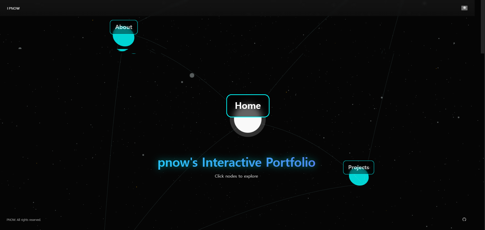
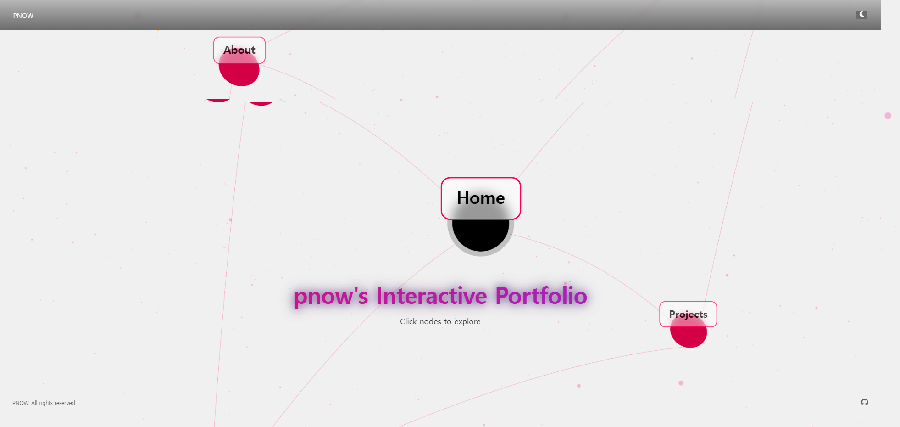

<div align="center">

# 🚀 Pnow7's Portfolio

**"현재에 충실히, 사용자에게 유용한 가치를 만드는 개발자"**

[](https://pnowsportfolio.vercel.app/)
[](https://github.com/pnow7)
[](https://reactjs.org/)
[](https://threejs.org/)

**[🌐 Live Demo](https://pnowsportfolio.vercel.app/)** | **[📂 GitHub Repository](https://github.com/pnow7/portfolio)**

</div>

---

## 📸 Preview

<div align="center">

### 🌙 Dark Mode


### ☀️ Light Mode


</div>

---

## 🎯 프로젝트 소개

**풀스택 개발자** 박현재의 인터랙티브 포트폴리오 웹사이트입니다.

3D 신경망 네트워크 비주얼과 현대적인 UI/UX를 결합하여 프로젝트 경험, 기술 스택, 교육 이력을 독창적으로 표현했습니다. 다크/라이트 모드를 지원하며, 반응형 디자인으로 모든 디바이스에서 최적화된 경험을 제공합니다.

### ✨ 특징

- **3D 인터랙티브 UI**: Three.js 기반의 신경망 네트워크 비주얼라이제이션
- **다크/라이트 모드**: 테마 전환 시스템
- **완전 반응형 디자인**: 모바일/태블릿/데스크톱 최적화
- **빠른 성능**: Vite 기반 빌드로 초고속 로딩
- **부드러운 애니메이션**: Framer Motion을 활용한 자연스러운 전환 효과
- **우주 테마 배경**: 커스텀 파티클 이펙트와 블랙홀 시뮬레이션

---

## 🚀 시작하기

### 사전 요구사항

- Node.js 16.0 이상
- npm 또는 yarn

### 설치 및 실행

```bash
# 저장소 클론
git clone https://github.com/pnow7/portfolio.git

# 프로젝트 디렉토리로 이동
cd portfolio

# 의존성 설치
npm install

# 개발 서버 실행
npm run dev

# 프로덕션 빌드
npm run build

# 빌드 미리보기
npm run preview
```

개발 서버는 기본적으로 `http://localhost:5173`에서 실행됩니다.

---

## 💡 프로젝트 하이라이트

사용자 경험(UX)과 기술적 효율성을 중시한 주요 프로젝트들을 소개합니다.

### 1. 🤖 AI 활용 체험 게임 플랫폼: 겜만중
**기간:** 2025.10.10 ~ 2025.10.28

**주요 기능**
- 사용자의 이미지 및 프롬프트를 기반으로 **DALL·E 3를 활용하여 캐릭터를 생성**하는 AI 체험 게임 플랫폼

**담당 역할**
- **AI 이미지 생성 모델 구현 및 최적화**
- **JWT 기반 인증/보안 시스템 및 로그인/소셜로그인 기능 구현**
- GCS 연동 이미지 관리 서비스
- 관리자 페이지 등 **풀스택 개발 전반** 담당

**기술 스택**
- Spring Boot, FastAPI, DALL·E 3, YOLOv8, JWT, React, GCS

**링크:** [GitHub Repository](https://github.com/pnow7/team-Gmaking)

---

### 2. 🍽️ 동해안 맛집 정보 공유 웹 서비스
**기간:** 2025.07.07 ~ 2025.07.28

**주요 기능**
- 카카오맵 연동 맛집 추천
- 사용자 리뷰 기반 **AI 요약 및 감성 분석** 기능

**담당 역할**
- 맛집 정보/리뷰/스레드 기능 구현
- 관리자 페이지 기능 구현
- **AI (OpenAI API) 연동** 담당

**기술 스택**
- React, Python(FastAPI), Spring Boot, Oracle, Kakao Maps API, OpenAI API

**링크:** [GitHub Repository](https://github.com/Team-2Gether/Local7)

---

### 3. 🏨 기업 스케줄 및 할일 관리 서비스
**기간:** 2025.06.10 ~ 2025.06.27

**주요 기능**
- 숙박업체 운영 인력의 **객실 운영, 스케줄, 업무 배정 통합 관리** 시스템

**담당 역할**
- 객실 관리, 직원 관리, 업무 배정 로직 구현

**기술 스택**
- Spring Boot, JSP, Oracle Database, IntelliJ IDEA

**링크:** [GitHub Repository](https://github.com/Team-MobyDick/hms)

---

## 👨‍💻 About Me

> **"현재에 충실히 하는 신입 개발자"**
>
> 사용자 경험을 중시하며 문제를 해결하는 것에 즐거움을 느낍니다.  
> 새로운 기술을 배우고 적용하는 것에 대한 열정이 높으며,  
> 맡은 일에 대한 **책임감**을 가지고 팀과 **협업**하여 최상의 결과물을 만들어내겠습니다.

**핵심 가치**
- **성장지향** - 끊임없이 배우고 발전하는 개발자
- **문제해결** - 기술로 실질적인 문제를 해결
- **협업** - 팀과 함께 더 나은 결과를 만들어냄
- **책임감** - 맡은 일에 대한 완수 의지
- **꾸준함** - 지속적인 학습과 개선
- **긍정적** - 긍정적인 마인드로 도전

---

**Made by Pnow7**

</div>
